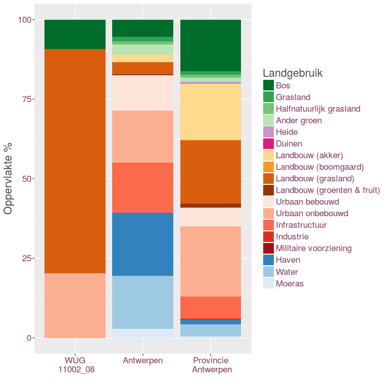
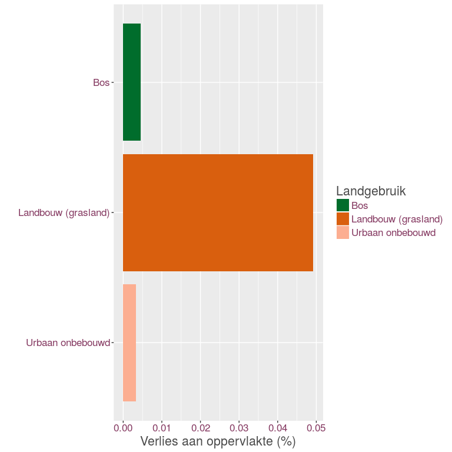
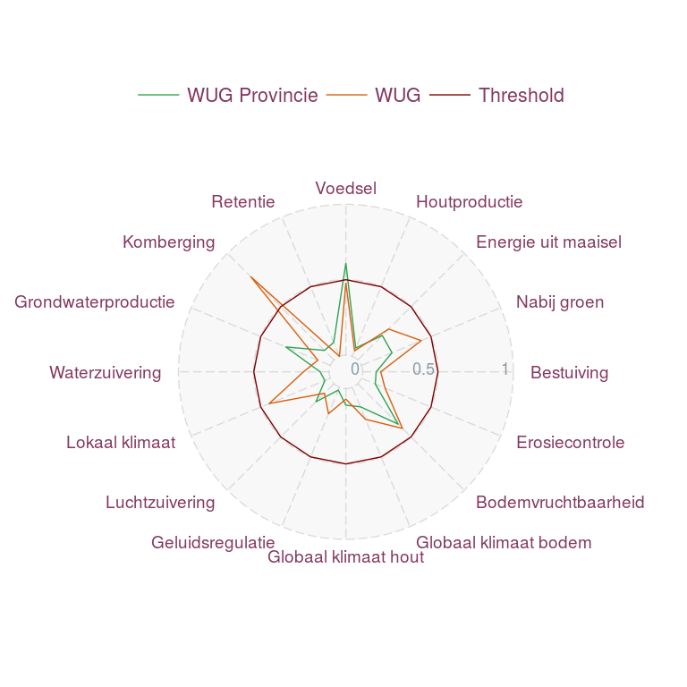
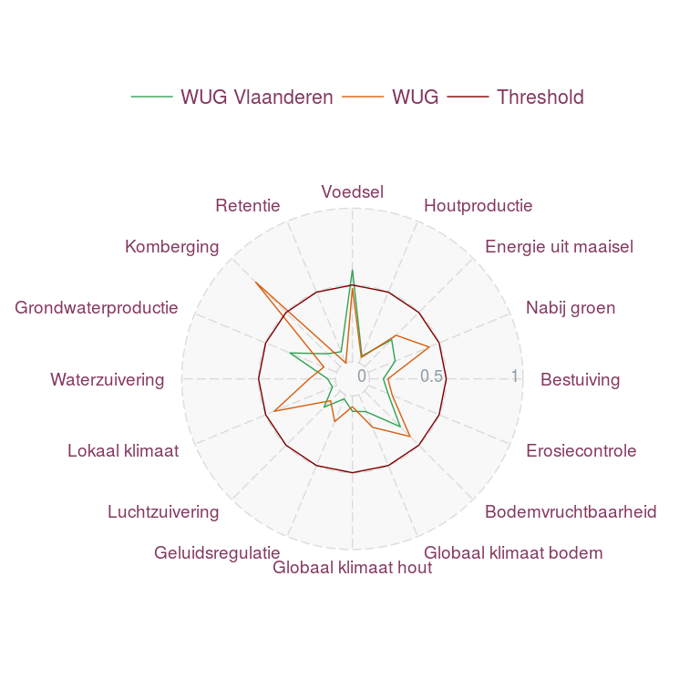

Introduction
------------

In this document, a short overview of the functions developed to make the WUG Rshiny application are showcased, as they can be used outside the scope of the application as well. For example, when making reports or doing other data analysis.

As the package is not available on CRAN, the easiest way of installing the package is using the `devtools` package and referring to the git repository holding the package code:

    devtools::install_github("inbo/woonuitbreidingsgebieden", 
                             subdir = "woonuitbreidingsgebieden")

Remark that the package itself is stored in a subfolder of the repository, which is tackled by the `subdir` command.

One installed, the functionalities can be derived by loading the package:

``` r
library("woonuitbreidingsgebieden")
```

On the one hand, the `extract_*` functions are created to extract the data for all WUG ids from the data source (excel-file), which is important for a proper usage of the Rshiny application. The `get_*` functions are created to extract the data for a single wug (either from the loaded data or directly from the excel-file). On the other hand, the `create_*` functions are used to make the graphs. The `support.R` script provide some additional help functions.

The plot functions operate on a single WUG, based on the WUG code. For a given WUG code, the data can be extracted (in a tidy structure) and consecutively, the graphs can be made for that WUG. The structuring of the data as a tidy format supports easy handling with e.g. `ggplot2`.

Within the package, there are actually two ways of extracting the data from the excel file:

1.  Loading (`get_*_excel`) the data for the specific WUG identifier directly from excel you're interested in. This is the most convenient from a user perspective when you just need information for a specific WUG, but requires a fixed and correct description in the column header names and excel sheet names.
2.  Extracting (`extract_*`) all data for either landuse or esd at the same time into memory, from which the data for a specific WUG can be loaded (`get_*`). More flexibility is provided in selecting the columns/sheets and the user can easily perform other functions/plots on the entire tidy dataset.

Both methods will be described in this tutorial, referred to as *single WUG* (1) versus *all WUG* (2). We will use the WUG `11002_08` (saved as variable `id_wug`) to illustrate the functionalities. TYhe excel file is hte default file provided by the package itself, but you can refer to a similar excel file on another location as well by adapting the path.

``` r
id_wug <- "11002_08"
xls_file <- "Afwegingskader_Wug.xlsx" # Location of the excel file with the source data
```

Single WUG
----------

### Landuse

#### Comparison percentage of area

To create the landuse plot, load the landuse data as percentages, referring to the excel file and the appropriate WUG identifier.

``` r
lu_data <- get_landuse_data_pt_excel(xls_file, id_wug)
```

and create the graph:

``` r
create_stacked_bar(lu_data)
```



#### Relative loss in the municipality

To create the landuse relative loss plot, load the landuse data as ha:

``` r
lu_data_ha <- get_landuse_data_ha_excel(xls_file, id_wug)
```

and create the graph:

``` r
create_loss_bar(lu_data_ha)
```



### Ecosystem services radar chart

Similar to the landuse data, loading the data:

``` r
esd_data <- get_esd_data_excel(xls_file, id_wug)
```

and create the graph:

``` r
create_radar(esd_data, reference = "gemeente", thresh = 0.5)
```


Within the latter function, the option to chooce a `reference` is included, providing the option to compare the ecosystem services of the individual WUG with the ecosystem services of the following options:

-   Gemeente : use `'gemeente'` as reference
-   Vlaanderen : use `'vlaanderen'` as reference
-   WUG gemeente : use `'wug_gemeente'` as reference
-   WUG provincie : use `'wug_provincie'` as reference
-   WUG Vlaanderen : use `'wug_vlaanderen'` as reference

As such, to make the comparison with the ESD of all the WUG area in the province, is is done as follows:

``` r
create_radar(esd_data, reference = "wug_provincie")
```



The threshold is the comparison value to compare with. The default is 0.5, but this can overwritten. When interested in an interactive version, use the function `create_interactive_radar` instead of `create_radar` with similar inputs. The result will be an HTML widget, using the `radarchart` package.

All WUG
-------

When working on the entire data set of all WUGs, the first thing to extract from the excel file is the linkage in between the WUG identifiers, the municipality and the province. This will provide the essential information to get the data of a specific WUG:

``` r
wug_link_data <- extract_link_table(xls_file, "Info_Wug")
```

The second argument is the name of the sheet in the excel file providing the linkage information.

### Landuse

In order to extract the landuse information of all WUGs in the excel file, the `extract_lu_data` function is provided. This function requires as input the names of the different excel sheets and the column names within these sheets to extract the data:

``` r
lu_columns <- c("Bos", "Grasland", "Halfnatuurlijk grasland",
                "Ander groen", "Heide", "Duinen", "Landbouw (akker)",
                "Landbouw (boomgaard)", "Landbouw (grasland)",
                "Landbouw (groenten & fruit)", "Urbaan bebouwd",
                "Urbaan onbebouwd", "Infrastructuur", "Industrie",
                "Militaire voorziening", "Haven", "Water", "Moeras")

lu_sheets <- c("LG_Wug_ha", "LG_Gemeenten_ha", "LG_Provincies_ha",
               "LG_WUG_%", "LG_Gemeenten_%", "LG_Provincies_%")
               
lu_data_all <- extract_lu_data(lu_sheets, xls_file, lu_columns)
```

This dataset can be used to do alternative analysis as well as `get` the information for a particular WUG and create plots. For example, for the WUG `11002_08`

``` r
lu_data_pt <- get_landuse_data_pt(lu_data_all, wug_link_data, id_wug)
```

The required inputs are the entire landuse dataset, the `wug_link_data` coupling WUG identifiers with municipality and province and the chosen `id_wug`.

Plotting of this WUG specific data is completely similar as in the first case:

``` r
create_stacked_bar(lu_data)
```


To create the landuse relative loss plot, get the data and use the same plot function as above:

``` r
lu_data_ha <- get_landuse_data_ha(lu_data_all, wug_link_data, id_wug)
create_loss_bar(lu_data_ha)
```


### Ecosystem services radar chart

In order to extract the ESD information of all WUGs in the excel file, the `extract_esd_data` function is provided. This function requires as input the names of the different excel sheets and the column names within these sheets to extract the data, similar to the landuse case:

``` r
esd_columns <- c("Voedsel", "Houtprod", "EnergieMaaisel",
                 "NabijGroen", "Bestuiving", "Erosie",
                 "Bodemvrucht", "Copslag_bodem", "Copslag_hout",
                 "Geluidsregulatie", "Luchtzuivering", "UHI",
                 "Denitrificatie", "DiepGrondwater", "Komberging NOG",
                 "Retentie")

esd_sheets <- c("ESD_Wug","ESD_Wug_Vlaanderen", "ESD_Wug_Provincie",
                "ESD_Wug_Gemeente", "ESD_Vlaanderen", "ESD_provincie",
                "ESD_Gemeente")
                
esd_data_all <- extract_esd_data(esd_sheets, xls_file, esd_columns)               
```

Getting the data for a specific WUG from this dataset and plotting the radarchart of (for example) the `wug_vlaanderen`, is performed as follows:

``` r
esd_data <- get_esd_data(esd_data_all, wug_link_data, id_wug)
create_radar(esd_data, reference = "wug_vlaanderen")
```


